# CloudWatch Dashboard for Amazon Lookout for Equipment
Amazon Lookout for Equipment uses the data from your sensors to detect abnormal 
equipment behavior, so you can take action before machine failures occur and 
avoid unplanned downtime. Use the content from this folder to learn how to build
a native CloudWatch dashboard that will help you visualize the models and
schedulers available in your AWS account.

### Prerequisites

To get the most out of this content, you need to have at least one Lookout for
Equipment model trained in your account and one scheduler configured. Your
scheduler must have already run and generated some inference data that you
will be able to visualize on a dashboard.

You can check out the [**Getting Started**](../../getting_started) section of 
this very repository to train your first model and you can let your inference 
run for an hour to start generating some data.

### Installation instructions
[**Create an AWS account**](https://portal.aws.amazon.com/gp/aws/developer/registration/index.html) if
you do not already have one: then you can setup your environment automatically 
by deploying the following CloudFormation template.

In another browser window, login to your AWS account. Once you have done that, 
open one of the link below (depending on the region closest to you) in a new tab 
to start the process of deploying the items you need via CloudFormation.

*Note: This material is designed to work in the regions where the service is 
available. Using other regions will cause issues.*

| Region |     | CloudFormation Stack |
| ---    | --- | --- |
| US East (N. Virginia) | **us-east-1** | [](https://us-east-1.console.aws.amazon.com/cloudformation/home?region=us-east-1#/stacks/new?stackName=L4ECloudWatchDashboard&templateURL=https://lookoutforequipmentbucket-us-east-1.s3.amazonaws.com/cloud-formation-templates/lookout-equipment-dashboards.yaml) |
| Europe (Ireland) | **eu-west-1** | [](https://eu-west-1.console.aws.amazon.com/cloudformation/home?region=eu-west-1#/stacks/new?stackName=L4ECloudWatchDashboard&templateURL=https://lookoutforequipmentbucket-eu-west-1.s3.eu-west-1.amazonaws.com/cloud-formation-templates/lookout-equipment-dashboards.yaml) |
| Asia Pacific (Seoul) | **ap-northeast-2** | [](https://ap-northeast-2.console.aws.amazon.com/cloudformation/home?region=ap-northeast-2#/stacks/new?stackName=L4ECloudWatchDashboard&templateURL=https://lookoutforequipmentbucket-ap-northeast-2.s3-ap-northeast-2.amazonaws.com/cloud-formation-templates/lookout-equipment-dashboards.yaml) |

#### Cloud formation Wizard
After you clicked on the `Launch stack` button above, you will be brought to 
the `Create stack` screen. Start by clicking `Next` at the bottom:

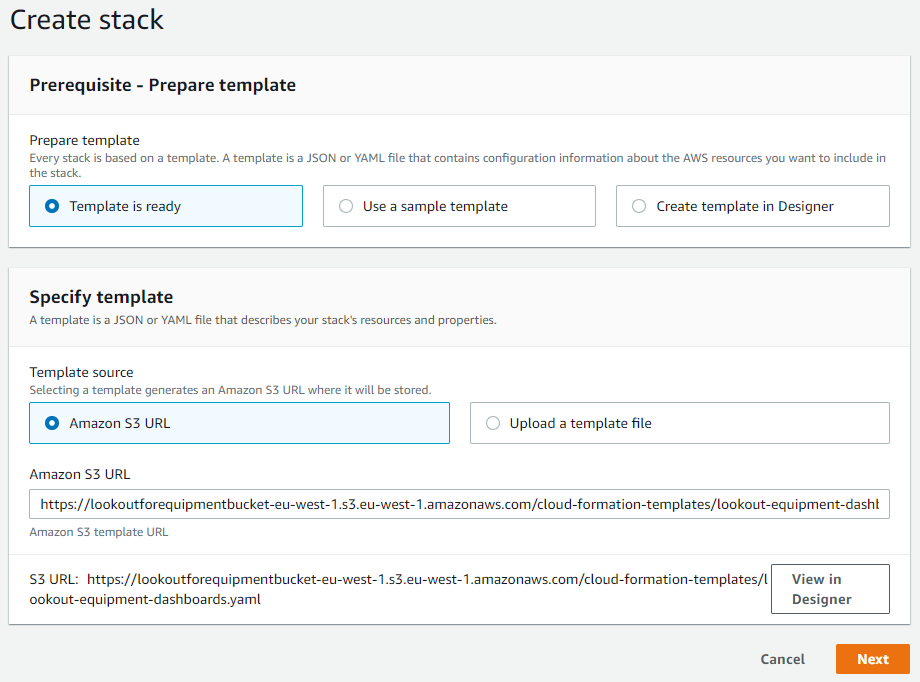

On the parameters page, you will have to fill in:
* `SnapshotBucket`: A unique name for the bucket where the dashboard snapshots and temporary files will be collected
* `SnapshotRuns`: The frequency (daily or weekly) at which the inference dashboard snapshot will be taken and sent by email
* `TargetEmail`: The email where the snapshots will be sent

The target email must be registered in Amazon Simple Email Service (SES). To do this:

1. Browse to the SES Console
2. In the left menu, click on `Email addresses`
3. Then, click on `Verify a New Email Address`
4. Fill in the address you want to use and click `Verify this Email address`
5. You will shortly receive an email in your inbox: click on the `link` link to verify your address.

Once you're fine with these parameters, click `Next`:

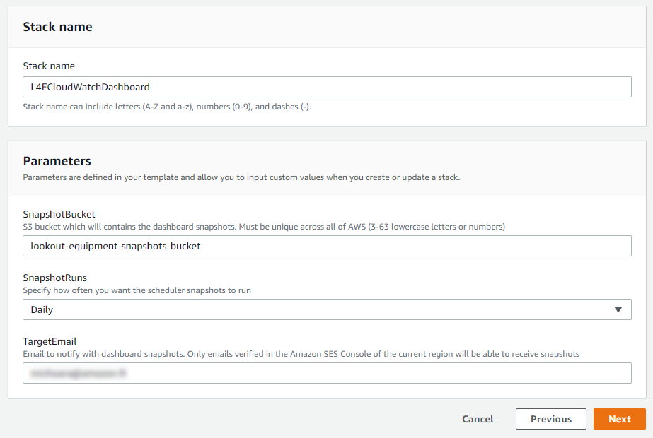

The stack configuration options page will also be fine with the default values,
click `Next` to proceed to the Review page. Scroll again to the bottom, check 
the box to enable the template to create new IAM resources and then click on 
`Create stack`:

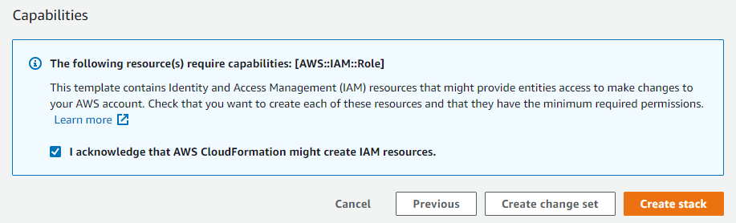

CloudFormation will take a few minutes to create the resources described above 
on your behalf:

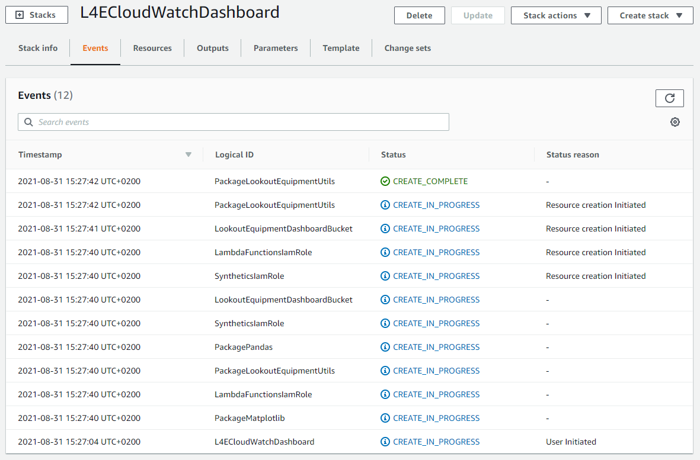

Once it is completed, you will see a green **CREATE_COMPLETE** message next 
to the name of the stack (on the left panel of the CloudFormation console), 
indicating that the deployment is completed.

#### Architecture overview
This template will deploy the following component in your AWS account:

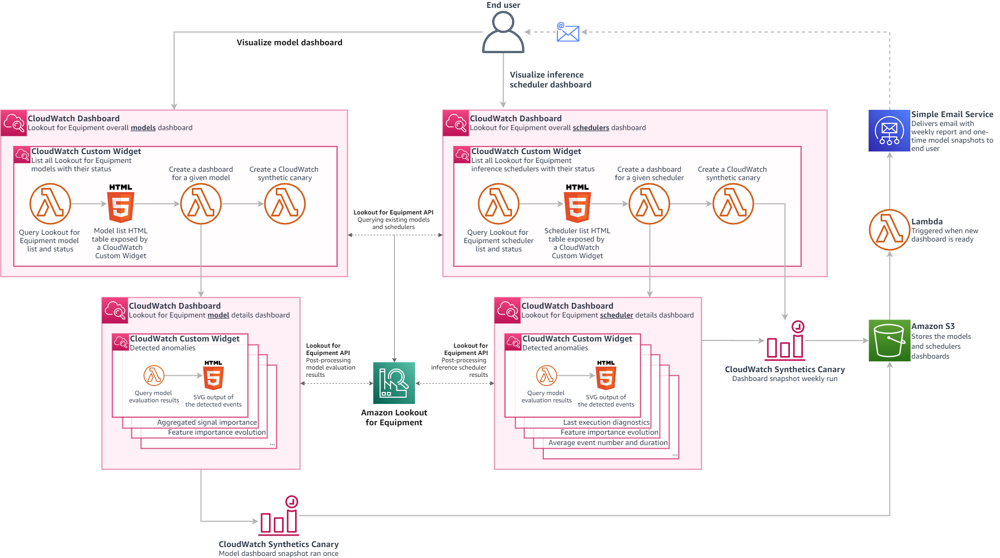

### Usage

Once the template is deployed, navigate to your [CloudWatch home page](https://console.aws.amazon.com/cloudwatch/home) 
and click on the `Dashboards` link on the left menu bar:

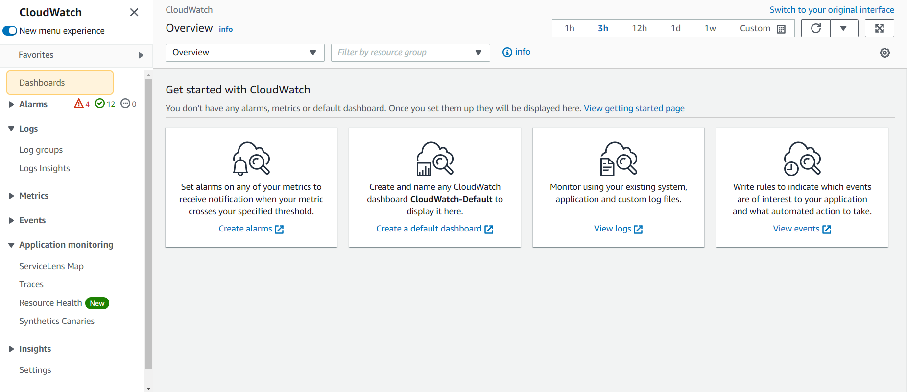

This will bring you to a page with the list of all the CloudWatch dashboards you
have access to in your account. You should find two new dashboards that you are
going to use to visualize your Amazon Lookout for Equipment models and 
schedulers:

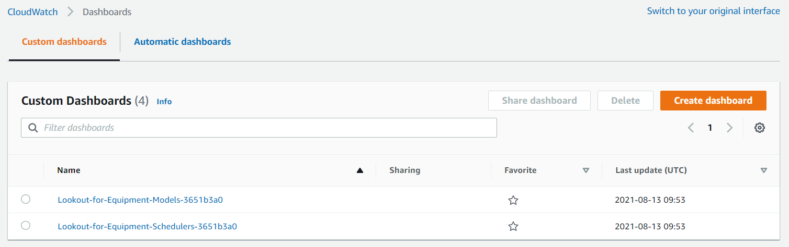

#### Models list dashboard
Click on the dashboard with a name starting by `Lookout-for-Equipment-Models`:
this will open a dashboard summarising all the models that exist in your 
account. By default, only the last 50 models trained in the past 3 months are shown:

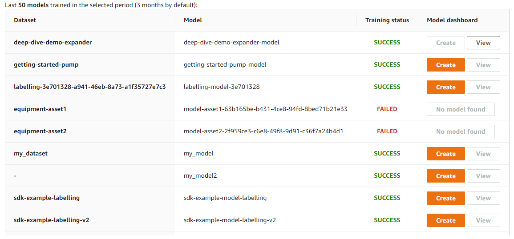

You can use the date picker on the top right to limit the models shown by their
training date. Your models are organized as such:

* The first column will list all the datasets from the current region in your account
* The model names are listed in the second column: if several models were built using
  the same dataset, the dataset name is not repeated for the sake of clarity
* In the third column, a training status will let you know if this model was successfully
  trained or not. Only a successful training will give you access to the actions of the
  fourth column
* The last column gives you two possible actions to perform on trained models:
  - You can request the creation of a specific dashboard for a trained model: this will
    create a new CloudWatch dashboard specifically for this model and will also configure
    and start a 
    [CloudWatch Synthetics](https://docs.aws.amazon.com/AmazonCloudWatch/latest/monitoring/CloudWatch_Synthetics_Canaries.html)
    canary that will send you a dashboard screenshot
    to the email you configured when you deployed the CloudFormation template. Dashboard
    and Synthetics creation can take a few seconds, then the models list dashboard will be
    refreshed and the `View` button will be enabled
  - The `View` button is enabled when a dashboard exists for a given model (the `Create`)
    button will then be disabled. Click on this button to navigate to this model's specific
    CloudWatch dashboard

#### Model evaluation results dashboard

When you click on the `View` button of any trained model, you are brought to another
CloudWatch dashboard dedicated to this model. Several widgets are preconfigured:

* **Model details:** this widget gives you a reminder of the dataset name, the training period
  and the evaluation period.
  
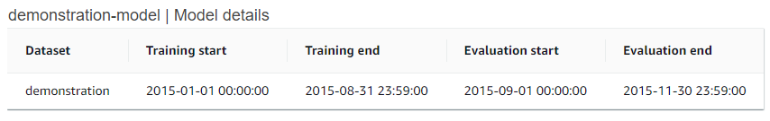

* **Detected anomalies:** the detected anomalies are displayed for the evaluation period. The
  dropdown at the top of the widget lets you select which signal you want to plot above the
  detected anomalies ribbon. This widget also plots the number of daily event detected and the
  average duration of the detected events over the evaluation period of the model:

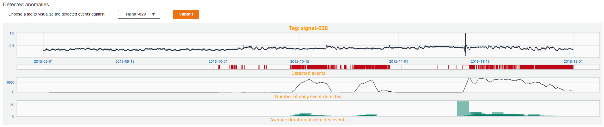

* **Aggregated signal importance:** his horizontal bar chart aggregates the average importance
  of up to 15 signals **across** the evaluation period.
  - While the native console from Amazon Lookout for Equipment lets you click on every event 
    detected to plot the associated signal importance, this plot lets you understand if there 
    is a systematic bias towards the same sensors when an event is detected. In the following 
    example, you can see that signal-078 is contributing, **in average**, a lot more than the
    other signals to the events detected.
  - The black dotted line materialize the value that each signal importance would have if they
    were all **equally** contributing to every anomalies detected. The dataset illustrated
    here had 122 signals. If every signal was contributing the same way, they would each be 
    ranked at approximately 1/122 = 0.82%. We can now say that the higher contribution from
    signal-078 is definitely statistically significant.
  - Every signals higher that the black dotted line will have a red bar, whereas the other ones
    will have a green bar.
    
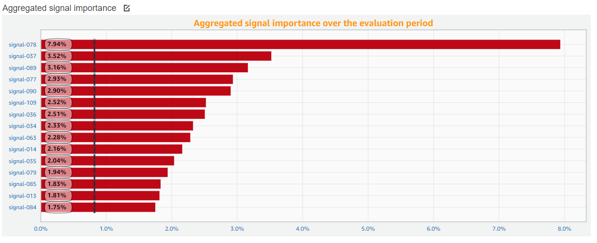

* The last widget plots the evolution of the feature importance of each signal over time. When
  numerous events are detected, this plot can become very crowded. At this stage, the feature
  importance is aggregated at the daily level to help better understand the dynamics of each
  signal.
  - During the period ranging from 2015-10-15 to 2015-11-01, you can actually see a different
    dynamic than during the last period (where a green signal is becoming preponderant)
  - This widget will help you understand if it is possible to match the signal contributions
    relationships to different types of failure.
  - A widget initially positionned on the right of this plot contains the associated legend

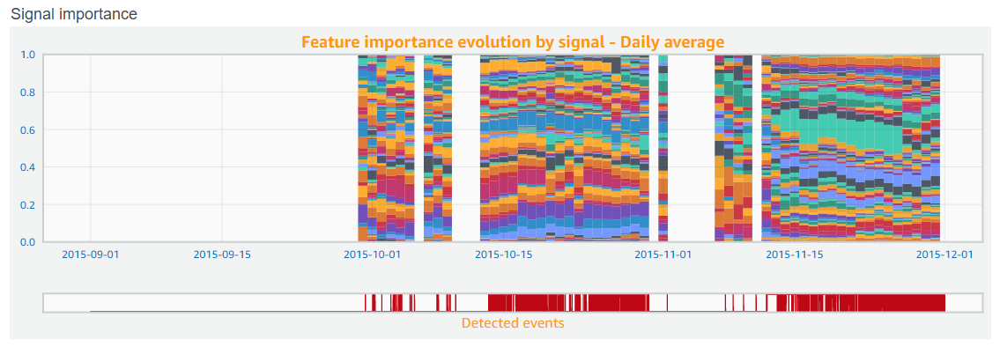

#### Schedulers list dashboard

Click on the dashboard with a name starting by `Lookout-for-Equipment-Schedulers`:
this will open a dashboard summarising all the schedulers that exist in your 
account. By default, only the last 50 schedulers created in the past 3 months are shown:

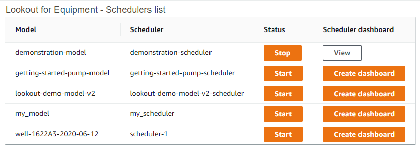

From this dashboard, you can either Start or Stop the schedulers. Bear in mind that running
schedulers incurs costs: do not forget to stop a scheduler that you have no more use of. As with the
trained models evaluation, you can also request the creation of specific dashboard dedicated
to a scheduler.

When you create a scheduler, you also create a [CloudWatch Synthetics](https://docs.aws.amazon.com/AmazonCloudWatch/latest/monitoring/CloudWatch_Synthetics_Canaries.html)
canary that will send you a weekly dashboard screenshot to the email you configured when you 
deployed the CloudFormation template. This canary is configured by default to run every
Monday morning at 6am UTC. Dashboard and Synthetics creation can take a few seconds, 
then the schedulers list dashboard will be refreshed and the `View` button will be enabled.

#### Inference results detailed dashboard

When you click on the `View` button of an existing inference scheduler, you are brought to 
another CloudWatch dashboard dedicated to this scheduler. A couple of widgets are preconfigured:

* **Scheduler details:** this widget gives you reminder of the scheduler name and how it is
  configured. It also details what it expects as an input (format and location of the input
  CSV file to run inference with). This can be useful when you run into issues with a
  scheduler that doesn't seem to find your fresh data.
  
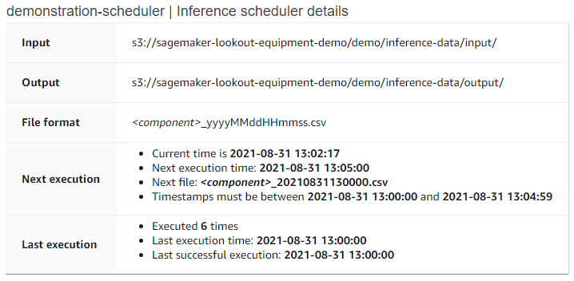

* **Last execution diagnostics:** this widget displays the signal ranking for the last
  anomaly caught by Amazon Lookout for Equipment:
  
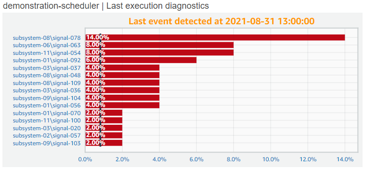

### Repository structure
This folder is structured as followed:

```
. cloudwatch-dashboard/
|
├── README.md                          <-- This instruction file
|
├── assets/                            <-- Pictures used throughout the README file
|
├── layers/                            <-- Lambda layers
|   |
|   ├── lookout-equipment/             <-- Utility layers used by the Lambda functions
|   |
|   └── create-layer.sh                <-- Script to generate a layer from a public
|                                          package such as `pandas` or `matplotlib`
|
├── lambdas/                           <-- Lambda functions source code
|
└── synthetics/                        <-- Synthetics canary code to take dashboard snapshots
```

## Questions

Please contact [**Michaël HOARAU**](mailto:michoara@amazon.fr) or raise an 
issue on this repository.

## Security

See [**CONTRIBUTING**](CONTRIBUTING.md#security-issue-notifications) for more 
information.

## License
This source code is licensed under the MIT-0 License. See the LICENSE file.
