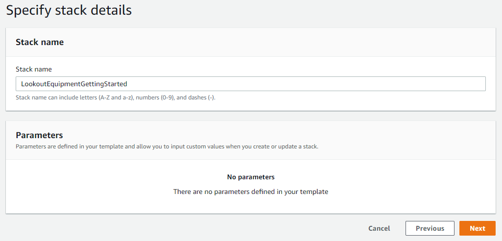
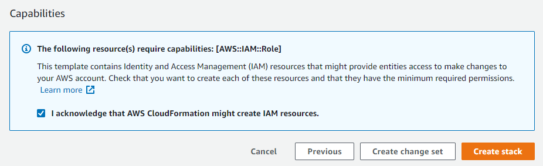
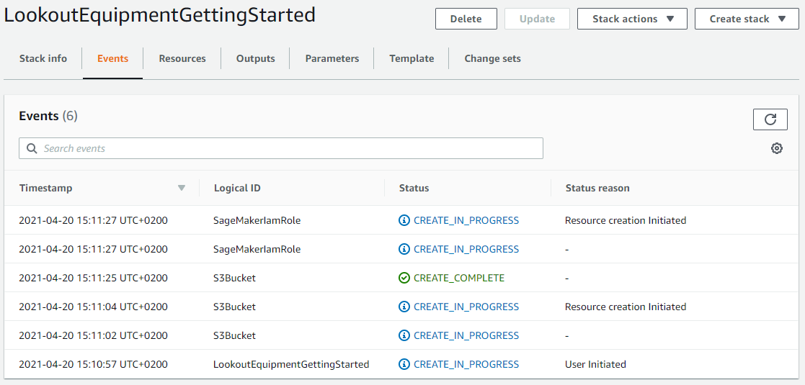
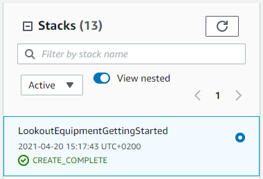
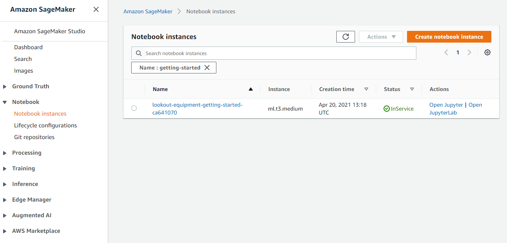

# Amazon Lookout for Equipment Getting Started.
Amazon Lookout for Equipment uses the data from your sensors to detect abnormal equipment behavior, so you can take action before machine failures occur and avoid unplanned downtime.

**Note:** *Expect between 1.5 and 2.5 hours to run this whole set of notebooks, including:*
* *Between 30 and 45 minutes of training time*
* *1 hour of scheduled inference to get enough relevant results to analyze (you can stop after the first inference is generated after 5 minutes though)*

## Overview
Amazon Lookout for Equipment analyzes the data from your sensors, such as pressure, flow rate, RPMs, temperature, and power to automatically train a specific ML model based on just your data, for your equipment – with no ML expertise required. Lookout for Equipment uses your unique ML model to analyze incoming sensor data in real-time and accurately identify early warning signs that could lead to machine failures. This means you can detect equipment abnormalities with speed and precision, quickly diagnose issues, take action to reduce expensive downtime, and reduce false alerts.

### Installation instructions
[**Create an AWS account**](https://portal.aws.amazon.com/gp/aws/developer/registration/index.html) if you do not already have one: then you can either setup your environment manually or automatically by deploying a CloudFormation template.

#### Automatic setup with CloudFormation
You will need a working environment in which to get your data ready for Amazon Lookout for Equipment. Most of the time, the size of the timeseries dataset you have to manipulate, prevents you from using your favorite spreadsheet software locally. You will deploy a CloudFormation template that will provision an environment for your work going forward. In another browser window, login to your AWS account.

Once you have done that, open one of the link below (depending on the region closest to you) in a new tab to start the process of deploying the items you need via CloudFormation.

*Note: This material is designed to work in the regions where the service is available. Using other regions will cause issues.*

| Region |     | CloudFormation Stack |
| ---    | --- | --- |
| US East (N. Virginia) | **us-east-1** | [](https://us-east-1.console.aws.amazon.com/cloudformation/home?region=us-east-1#/stacks/new?stackName=LookoutEquipmentGettingStarted&templateURL=https://lookoutforequipmentbucket-us-east-1.s3-us-east-1.amazonaws.com/cloud-formation-templates/lookout-equipment-getting-started.yaml) |
| Europe (Ireland) | **eu-west-1** | [](https://eu-west-1.console.aws.amazon.com/cloudformation/home?region=eu-west-1#/stacks/new?stackName=LookoutEquipmentGettingStarted&templateURL=https://lookoutforequipmentbucket-eu-west-1.s3-eu-west-1.amazonaws.com/cloud-formation-templates/lookout-equipment-getting-started.yaml) |
| Asia Pacific (Seoul) | **ap-northeast-2** | [](https://ap-northeast-2.console.aws.amazon.com/cloudformation/home?region=ap-northeast-2#/stacks/new?stackName=LookoutEquipmentGettingStarted&templateURL=https://lookoutforequipmentbucket-ap-northeast-2.s3-ap-northeast-2.amazonaws.com/cloud-formation-templates/lookout-equipment-getting-started.yaml) |

#### Cloud formation Wizard
After you clicked on the `Launch stack` button above, you will be brought to the `Create stack` screen. Start by clicking `Next` at the bottom:


All the default options should be fine, click `Next`:



The stack configuration options page will also be fine with the default values, click `Next` to proceed to the Review page. Scroll again to the bottom, check the box to enable the template to create new IAM resources and then click on `Create stack`:



CloudFormation will take a few minutes to create the resources described above on your behalf:



Once it is completed, you will see a green **CREATE_COMPLETE** message next to the name of the stack (on the left panel of the CloudFormation console), indicating that the deployment is completed:



Navigate to the [SageMaker landing page](https://console.aws.amazon.com/sagemaker/home) and click the `Notebook Instances` link on the left menu bar:



To get to the Jupyter interface, simply click `Open JupyterLab` on the far right next to your notebook instance. Clicking the open link will take a few seconds to redirect you to the Jupyter system but once there you should see a collection of files on your left.

To get started, you should see a folder `getting_started` in the file browser to your left: open that folder and proceed to [**configuration file**](config.py). In this file, update the bucket name with the one generated previously by CloudFormation. This bucket should have a name that starts with `lookoutequiment-getting-started`. You will use this bucket to store the intermediate files generated throughout this tutorial. You can leave all the other parameters to their default values.

#### Manual setup
Once you are in a region where you have access to the service, login to your AWS account, navigate to the SageMaker console and create a new instance. Using an **ml.t3.medium** instance with the standard 5 GB attached EBS volume is enough to process and visualize the dataset comfortably. To enable exploration of big timeseries dataset, you might need to increase the EBS volume size. Some plots can take up a significant amount of memory: in such exploration, it's not unusual to move to bigger memory optimized instance (like the **ml.m5.xlarge** one), but that won't be necessary for this tutorial.

You need to ensure that this notebook instance has an **IAM role** which allows it to call the Amazon Lookout for Equipment APIs:

1. In your **IAM console**, look for the SageMaker execution role endorsed by your notebook instance (a role with a name like `AmazonSageMaker-ExecutionRole-yyyymmddTHHMMSS`)
2. On the `Permissions` tab, click on `Attach policies`
3. In the Filter policies search field, look for `AmazonLookoutEquipmentFullAccess`, tick the checkbox next to it
4. Now, in the same search field, look for `AmazonSSMFullAccess`, tick the checkbox next to it and click on `Attach policy`
5. Browse to the `Trust relationship` tab for this role, click on the `Edit trust relationship` button and fill in the following policy. You may already have a trust relationship in place for this role, in this case, just add the **"lookoutequipment.amazonaws.com"** in the service list:

```json
{
  "Version": "2012-10-17",
  "Statement": [
    {
      "Effect": "Allow",
      "Principal": {
        "Service": [
          "sagemaker.amazonaws.com",
            
          // ... Other services
            
          "lookoutequipment.amazonaws.com"
        ]
      },
      "Action": "sts:AssumeRole"
    }
  ]
}
```
6. Click on `Update the Trust Policy`: your SageMaker notebook instance can now call the Lookout for Equipment APIs and the service will have the appropriate access to the S3 buckets where the data will be located.

You can know navigate back to the Amazon SageMaker console, then to the Notebook Instances menu. Start your instance and launch either Jupyter or JupyterLab session. From there, you can launch a new terminal and clone this repository into your environment using `git clone`.

Once you've cloned this repo, open the [**configuration file**](config.py) and update the bucket name you want to use to store the intermediate files generated throughout this tutorial. You can leave all the other parameters to their default values.

### Repository structure
Browse to the [**data preparation**](1_data_preparation.ipynb) notebook: this first notebook will download and prepare the data necessary before you move to other ones.

*Note: if you are not familiar with Jupyter Notebooks, watch this YouTube video for a quick introduction to some basics: https://www.youtube.com/watch?v=jZ952vChhuI*

```
.
|
├── README.md                          <-- This instruction file
|
├── assets/                            <-- Pictures used throughout the notebooks
|
├── 1_data_preparation.ipynb           <-- START HERE: data preparation notebook, useful to
|                                          download and prepare the data, get familiar with
|                                          them
├── 2_dataset_creation.ipynb           <-- Create a Lookout for Equipment dataset
├── 3_model_training.ipynb             <-- Train a Lookout for Equipment model
├── 4_model_evaluation.ipynb           <-- Plot the evaluation results and some diagnostics
├── 5_inference_scheduling.ipynb       <-- Schedule a regular inference execution and plot
|                                          the obtained results
├── 6_cleanup.ipynb                    <-- Cleanup the resources created in this tutorial
|
└── utils/
    └── lookout_equipment_utils.py     <-- Utilities to manage Lookout for Equipment assets
```

## Questions

Please contact [**Michaël HOARAU**](mailto:michoara@amazon.fr) or raise an issue on this repository.

## Security

See [**CONTRIBUTING**](CONTRIBUTING.md#security-issue-notifications) for more information.

## License
This collection of notebooks is licensed under the MIT-0 License. See the LICENSE file.